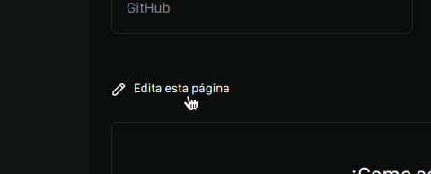

 

  

  
  

  <strong>
  📝 Repositorio para la documentacion de FileBeam
  </strong>
  

  

  

    

  <strong>
  <a href="https://github.com/filebeam/filebeam">Repositorio Principal</a> • 
  <a href="https://docs.filebeam.xyz">Ver la documentacion</a>
  </strong>
  <h6>
  
  

## Contribuir

Si deseas contribuir a la documentacion de FileBeam, puedes hacerlo editando los archivos que se encuentran dentro de la carpeta [`/src/content/docs`](https://github.com/filebeam/docs/tree/master/src/content/docs) y crear un pull request con tus cambios, tambien puedes hacerlo desde el enlace *"Edita esta página"* que se encuentra al final de cada pagina en la documentacion, como se muestra en la imagen de abajo

> *Tambien puedes apoyar este proyecto simplemente dandole una estrella a este repositorio si este te ha servido o lo consideras de utilidad* ✨

## Licencia

FileBeam es un software de código abierto bajo la licencia [GNU GPL-v3.0](https://github.com/filebeam/docs/blob/main/LICENSE).
